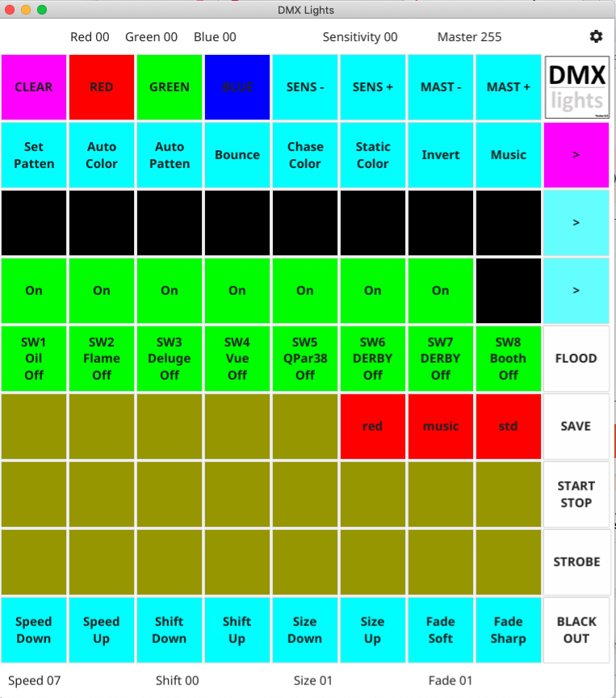

# DMX Lights

## Introduction

DMX lights is a Open Source Project to control DMX light fixtures.  It is designed for the small to medium mobile disco rig and be very easy to setup and use.

Firstly we use the Novation Launchpad Mini (Mk3) as the control surface and a cheap FTDI RS422 controller as the interface for the DMX lights.

Second design goal was to do away with having to have a large fixture library,  with DMX lights you simply add the description of what channels
do what to a simple text file.

As of versions 2.0 of dmxlights we now support a fixture editior. The editor is started by clicking on the DMX Lights logo in the top right.

## Features

- Four sequence groups.
- Automatic chases and automatic color, gobo and patten change.
- Control of speed, pattern shift, size and fade.
- Selectable chase bounce.
- Chase color selection.
- Chases can be inverted.
- Sound trigger 800Hz, with fine sensitivity adjustment.
- Master brightness.
- RGB, scanners, and projectors supported.
- Configurable switch bank. 
- Selectable static colors. 
- Mini sequencer for single fixture control.
- Indepentent selection of scanner colors and gobos.
- Direct flood button.
- Strobe set by selected sequence.
- Single key blackout.
- Fixture editor.

## Instalation

clone the DMX lights repositary

git clone github.com/dhowlett99/dmxlights

### Set up the modules and build the code with :-


```sh
make build
```

or on a older mac
```sh
make legacy-build
```
creates a dmxlights binary.
```sh
./dmxlights
```

### Creating a Mac application.

```sh
make deploy 
```
```sh
make legacy-deploy
```
creates a dmxlights.app which can be double clicked to start or 
dragged onto the dock.


### Setting up your fixtures

The simplest of fixture definitions is shown below:-

fixtures.yaml

```yaml
fixtures:
- name: FOH PAR
  description: RGB PAR
  type: rgb
  address: 1
  group: 1
  channels:
  - number: 1
    name: Red1
  - number: 2
    name: Green1
  - number: 3
    name: Blue1
```

Fixture Definition
| Field |  Function |
|-|-|
| name | The name is arbitrary and is only used as a label.|
| description | The description is arbitrary and only used to record extra info on the fixture.|
| type | The type defines the sequence type.  Valid values are rgb, scanner, switch.|
| address | The address is the DMX start address you have programed your fixture at.|
| group | The group defines which sequence this fixture belongs too.|
| channels | The channels is the list of the fixtures available DMX traits, these have a number and a name. See below.|

Channel Definition

| Field |  Function |
|-|-|
| Number  |  The DMX channel number
| Name    |  Channel Names, the name is used to indicate channel funtion.
| Value     | Used to set a static value when the name is set to 'Static.
| MaxDegrees | Tells dmxlights what the fixture is capable of.
| Offset     | Offset allows you to position the fixture.
| Comment  | This is is arbitrarty text field.
| Settings  | Further details

### Settings example

You can specifty further details for a channel. This examples outlines the different functions for channel 3 named shutter.

``` yaml
- number: 3
    name: Shutter
    settings:
      - name: Open
        setting: 255
      - name: Closed
        setting: 0
      - name: Strobe
        setting: 100
```

## Channel Example

 Channel Names, the name is used to decide which number in the Sequence and what color it will be. Valid names are

RGB Fixture - Valid Channel Names or Keywords are :-
| Field |  Function |
|-|-|
|Red1 | Channel respondes to fixture 1 Red
|Green1 | Channel respondes to fixture 1 Green |
|Blue1 | Channel respondes to fixture 1 Blue
|Red2 | Channel respondes to fixture 2 Red
|Green2 | Channel respondes to fixture 2 Green
|Blue2 | Channel respondes to fixture 2 Blue|
|Red3 | Channel respondes to fixture 3 Red|
|Green3 | Channel respondes to fixture 3 Green|
|Blue3 | Channel respondes to fixture 3 Blue|
|Red4 | Channel respondes to fixture 4 Red|
|Green4 | Channel respondes to fixture 4 Green|
|Blue4 | Channel respondes to fixture 4 Blue|
|Red5 | Channel respondes to fixture 5 Red|
|Green5 | Channel respondes to fixture 5 Green|
|Blue5 | Channel respondes to fixture 5 Blue|
|Red6 | Channel respondes to fixture 6 Red|
|Green6 | Channel respondes to fixture 6 Green|
|Blue6 | Channel respondes to fixture 6 Blue|
|Red7 | Channel respondes to fixture 7 Red|
|Green7 | Channel respondes to fixture 7 Green|
|Blue7 | Channel respondes to fixture 7 Blue|
|Red8 | Channel respondes to fixture 8 Red|
|Green8 | Channel respondes to fixture 8 Green|
|Blue8 | Channel respondes to fixture 8 Blue|
|Dimmer|Channel respondes to Master Brightness ( alternative to Master above|
|Static| Channel is used to set static DMX value. See settings example above.

Scanner Fixture - Valid Channel Names or Keywords are :-
| Field |  Function |
|-|-|
|Shutter | Channel respondes Shutter Size |
|Pan| Channel respondes Scanner Pan|
|FinePan| Channel respondes Scanner Fine Pan - Not currently Used|
|Tilt| Channel respondes Scanner Tilt|
|FineTilt| Channel respondes Scanner Fine Tilt - Not currently Used|
|Gobo| Channel respondes to Gobo Selection|
|Color| Channel respondes to Color Selection|
|Master |Channel respondes to Master Brightness |
|Dimmer|Channel respondes to Master Brightness ( alternative to Master above|

## Running DMX lights

Plug the FTDI interface card and Novation Lauchpad using their respective USB cables.

```sh
./dmxlights
```

## LaunchPad Layout

The launchpad buttons are laid out in a simple manner, the very top row are global controls.
The next four top rows are reserved to control and display the sequence as defined in the fixtures.yaml file.
The bottom three rows are reserved as storage for your scenes. Once you have selected all the required sequence
charateristics you can press the SAVE buttton and the one of these preset buttons to store the scene.



The very bottom row of buttons give more controls but these are specific to the selected sequence.

The buttons on the far right allow you to select a sequence, save presets, start a sequence, stop a sequence
The botton far right is the blackout button.

## Sequences

A sequence is the basic control set in DMX Lights. A sequence can have a few different modes depending on
the sequence type.

## Chase Sequence

A basic chase sequence of 8 fixtures with 8 different colors.

## Scanner Sequence

A specific to a scanner, this type of sequence can scan in a circle, left to right, up and down and finally in saw tooth motion.

## Static Colors

A static color sequence is where you want to setup a set of uplighters with specific colors.

## Switch Sequence

A switch sequence is simply eight switches that can be used to control simple devices like projectors.
A swicth can have multiple states, for example you could set a fixture to have specific color, brightness or Gobo.

## Default configuration

The top row is configured as a stardard RGB sequence, assuming these will be configures to run the front of house PAR cans.
The next row is your uplighters, I would expect them to be placed around the room to give backgroud lighting. Again this sequence is configured as a RGB sequence.
Next are the scanners arrange in sequence. Scanner sequences light different colors to represent the position of each scanner. By default all scanners follow the same patten and position in the patten. 
Finallay the last sequence is configured as a switch sequence. The eight buttons represent the state of a DMX fixture. Useful for turning on a projector. Every time you press a switch seqence fixture it will cycle through the states as defined in the fixtures.yaml file.

As soon as you start DMX lights the sequences will start to run,  you get a chase patten as soon as the pattens have been read from the configuration.  

# RGB Sequence configuration

A RGB sequence will start with a green chase from left  to right. You can configure the following using the functions. 

## RGB Functions 

To access RGB functions press the select button for this sequence twice.
The Function keys light up pink. Functions are labeled from the left.

|Number | Function | Description |
|-|-|-|
| 1 |Patten Selection | Selects Sequence Patten|
| 2 | Auto Color | Makes the sequence select a color automatically|Auto Patten |
|3 | Auto Pattern | Makes the sequence select a patten automatically |
| 4 |Bounce|Will make the sequence bounce. Sequence auto reverses. |
| 5 | Chase Color Selection|  Set RGB chase colors|
| 6 | Static Color Selection | Set static color |
| 7 | Invert Chase | Invert the RGB colors  |
| 8 | Music Trigger | Sequence will step in time to music.


### Function 1  Patten Selection

Press function 1 reveals the available pattens for this sequence.

|Number | Patten | Description |
|-|-|-|
|1|Chase Standard Chase | Green chase from left to right.
|2| Flash | All fixtures flash on and off in white.
|3| RGB Chase| Fixtures flash red, green and then blue.
|4| Pairs | Fixtures chase in pairs.|
|5| Inward | Fixtures start at both ends and chase inward.|
|6| Color Chase | A single fixture will  step through 8 colors|
|7| Multi Color Chase| All fixtures will step through 8 colors, out of sync with each other.|

Function 2 Automatic color selection.

Press Function 2 and the button will light to indicate auto color selection has been engaged. Auto colors will remain active until you press this function again. Auto colors overrides the manual color selection and the colors set in the original patten.

Function 3 Automatic pattern selection

Press Function 3 and the button will light to indicate auto pattern selection has been engaged. Auto patterns will remain active until you press this function again. Auto patterns overrides the manual pattern selection and the pattern set in the original patten.

Function 4 Bounce - Auto Reverse.

Press Function 4 and the button will light to indicate auto reverse selection has been engaged. Auto reveres overrides the pattern set in the original patten. Chase will appear to bounce from left to right and then right to left until you press this function again. 

Function 5 Chase Color Selection

Press Function 5 and eight colors will appear, you can then select the colors you require in the sequence. You can select up to eight colors and add weighting, for example red, red, green and blue will give you 4 colors with two reds, a green and then a blue. Pressing the clear button will clear the selection. Selected colors will flash. Press the sequence select button to exit manual chase color selection. 

Function 6 Static Color Selection.

Press function 6 to select static colors for this sequence.
A sequence can be completely static with no chases in this mode.
A display of eight colors will appear, touch a button to cycle through the color for that fixture. Also pressing red, green or blue will adjust the amount of each,  enabling a full color pallete for each fixture. Press the select button twice to get back to the function display and press function 6 to toggle off the static display.

Function 7 Invert Chase

Press function 7 to invert the chase colors.
A chase is inverted to black so if you have a green fixture chasing you will invert the sequence, and get a black fixture chasing on a green background. Press function 7 again to toggle off the invert chase function.

Function 8 Music Trigger.

Pressing function 8 will disable the speed of the sequence completely and the chase will step in time to the music. Music sensitivity is auto detected on the volume of the sound. But you can effect a fine tunning by pressing Sens- or Sens+ to increase or decrease the reaction to the music being played. Sens- and Sens+ apply to all sequences using the music trigger.

