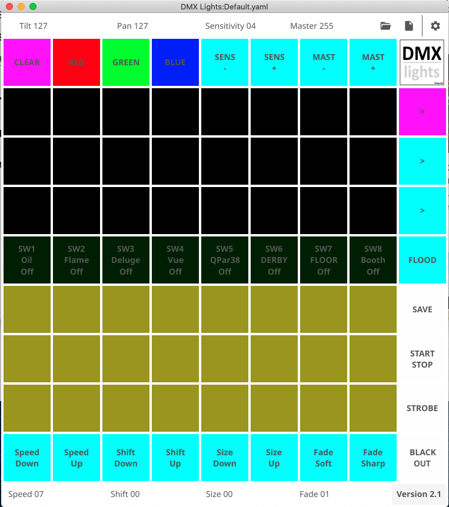

# DMX Lights.


## Introduction

DMX lights is a Open Source Project to control DMX light fixtures.  It is designed for the small to medium mobile disco rig and be very easy to setup 
and use.

Firstly we use the Novation Launchpad Mini (Mk3) as the control surface and a cheap FTDI RS422 controller as the interface for the DMX lights.

Second design goal was to do away with having to have a large fixture library,  with DMX lights you simply add the description of what channels
do what to a simple text file.

## Instalation

clone the DMX lights repositary 

git clone github.com/dhowlett99/dmxlights

set up the modules

```sh
export GO111MODULE=on
go mod init
go mod tidy

go build dmxlights.go
```

### Setting up your fixtures

The simplest of fixture definitions is shown below:- 

fixtures.yaml

```yaml
fixtures:
- name: FOH PAR
  description: RGB PAR
  type: rgb
  address: 1
  group: 1
  channels:
  - number: 1
    name: Red1
  - number: 2
    name: Green1
  - number: 3
    name: Blue1
```

| Field |  Function |
|-|-|
| name | The name is arbitrary and is only used as a label.
| description | The description is arbitrary and only used to record extra info on the fixture.
| type | The type defines the sequence type.  Valid values are rgb, scanner, switch.
| address | The address is the DMX start address you have programed your fixture at.
| group | The group defines which sequence this fixture belongs too.
| channels | The channels is the list of the fixtures available DMX traits, these have a number and a name. See below. 


Channels Names, the name is used to decide which number in the Sequence and what color it will be. Valid names are

|Sequence Number | Color | Name|
|-|-|-|
|1   |  Red   | Red1   |
|1   |  Green | Green1 |
|1   |  Blue  | Blue1  |
|2   |  Red   | Red2   |
|2   |  Green | Green2 |
|2   |  Blue  | Blue2  |
|3   |  Red   | Red3   |
|3   |  Green | Green3 |
|3   |  Blue  | Blue3  |
|4   |  Red   | Red4   |
|4   |  Green | Green4 |
|4   |  Blue  | Blue4  |
|5   |  Red   | Red5   |
|5   |  Green | Green5 |
|5   |  Blue  | Blue5  |
|6   |  Red   | Red6   |
|6   |  Green | Green6 |
|6   |  Blue  | Blue6  |
|7   |  Red   | Red7   |
|7   |  Green | Green7 |
|7   |  Blue  | Blue7  |
|8   |  Red   | Red8   |
|8   |  Green | Green8 |
|8   |  Blue  | Blue8  |


## Running DMX lights

Plug the FTDI interface card and Novation Lauchpad using their respective USB cables.

```sh
./dmxlights
```


## LaunchPad Layout


The launchpad buttons are laid out in a simple manner, the very top row are global controls.

The next four top rows are reserved to control and display the sequence as defined in the fixtures.yaml file.

The bottom three rows are reserved as storage for your scenes. Once you have selected all the required sequence 
charateristics you can press the SAVE buttton and the one of these preset buttons to store the scene.




The very bottom row of buttons give more controls but these are specific to the selected sequence.

The buttons on the far right allow you to select a sequence, save presets, start a sequence, stop a sequence
The botton far right is the blackout button.

## Sequences

A sequence is the basic control set in DMX Lights. A sequence can have a few different modes depending on 
the sequence type.


## Chase Sequence

A basic chase sequence of 8 fixtures with 8 different colors.

## Scanner Sequence

A specific to a scanner, this type of sequence can scan in a circle, left to right, up and down and finally in saw tooth motion.

## Static Colors 

A static color sequence is where you want to setup a set of uplighters with specific colors.

## Switch Sequence

A switch sequence is simply eight switches that can be used to control simple devices like projectors.
A swicth can have multiple states, for example you could set a fixture to have specific color, brightness or Gobo.


##