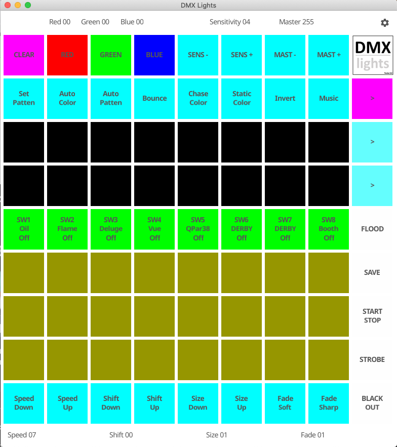
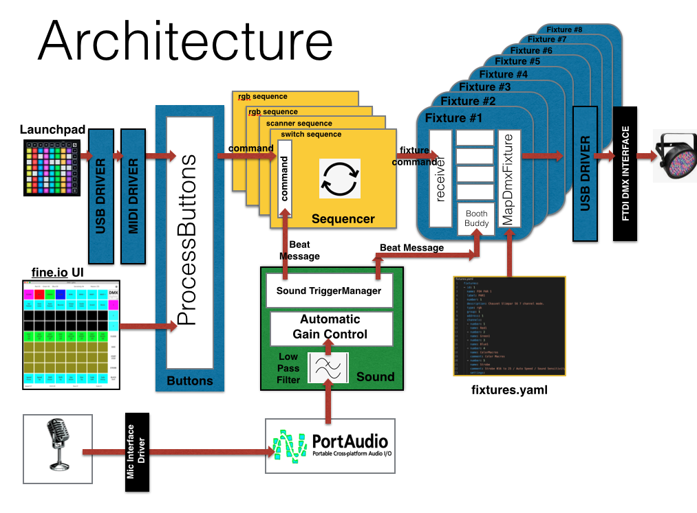

# dmxlights
A DJ lighting package

A DMX lighting controller that uses a Novation Launchpad as a control surface and a cheap FTDI interface for 
connecting to the lighting fixtures.




Novation Launchpad Mini Mk3 - https://novationmusic.com/en/launch/launchpad-mini
FTDI interface card is USB to RS485 TTL Serial Converter Adapter FTDI interface FT232RL 75176 Module_AM.

Built for Apple Mac (tested on Catalina 10.15.7)

[DMX Lights Manual.](./Manual.md)

# Dependances
- github.com/scgolang/midi
- github.com/oliread/usbdmx/ft232"
- github.com/gordonklaus/portaudio
- fyne.io/fyne/v2

<br/>

# Architecture 



# FTDI Integration

## Notes on getting the FTDI interface working.

If you see the following error:
```
2021/08/08 17:29:33 Failed to connect DMX Controller: failed to select interface #0 alternate setting 0 of config 1 of device vid=0403,pid=6001,bus=38,addr=1: failed to claim interface 0 on vid=0403,pid=6001,bus=38,addr=1,config=1: libusb: bad access [code -3]
```

Stop the USB driver grabbing the device.

Looks like other drivers could be claiming the channel.
```
$ kextstat | grep -i ftdi
  161    0 0xffffff7f82d5a000 0x7000     0x7000     com.FTDI.driver.FTDIUSBSerialDriver (2.3) ECC3AF36-431D-370D-86F2-5237785E9CF8 <107 49 5 4 3 1>
```
Remove one or both
```
$ sudo kextunload -b com.FTDI.driver.FTDIUSBSerialDriver
$ sudo kextunload -b com.apple.driver.AppleUSBFTDI
```
##  Launch Pad Integration

github.com/scgolang/midi

## Installing on Catalina 

I have found that the version of libusb-1.0.0.dylib used by the FTDI DMX interface card fails to connect when using the version from the 'brew install libusb' 
Note if running as root the card does connect but this wasn't deemed a suitable fix as 
starting the app from the dock runs as a used.


Otool reveals it has an extra '/System/Library/Frameworks/Security.framework/Versions/A/Security' attribute and the file size is different.
 otool -L libusb-1.0.0.dylib 
```libusb-1.0.0.dylib:
	/usr/local/opt/libusb/lib/libusb-1.0.0.dylib (compatibility version 4.0.0, current version 4.0.0)
	/usr/lib/libobjc.A.dylib (compatibility version 1.0.0, current version 228.0.0)
	/System/Library/Frameworks/IOKit.framework/Versions/A/IOKit (compatibility version 1.0.0, current version 275.0.0)
	/System/Library/Frameworks/CoreFoundation.framework/Versions/A/CoreFoundation (compatibility version 150.0.0, current version 1677.104.0)
	/System/Library/Frameworks/Security.framework/Versions/A/Security (compatibility version 1.0.0, current version 59306.140.5)
	/usr/lib/libSystem.B.dylib (compatibility version 1.0.0, current version 1281.100.1)
```

### SOLUTION...

I have found the the libusb-1.0.0.dylib from xcode distribution is different and allows the FTDI DMX to connect. From /opt/local/lib/libusb-1.0.0.dylib
File size is also smaller 111044.

/usr/local/opt/libusb/lib/libusb-1.0.0.dylib
```
-r--r--r--   1 derek  admin  141344 30 Nov 22:47 NOT_WORKING-libusb-1.0.0.dylib
-rwxr-xr-x   1 derek  admin  111044 30 Nov 22:51 libusb-1.0.0.dylib
```

``` otool -L /Volumes/USEFUL/libusb-1.0.0.dylib 
/Volumes/USEFUL/libusb-1.0.0.dylib:
	/opt/local/lib/libusb-1.0.0.dylib (compatibility version 4.0.0, current version 4.0.0)
	/usr/lib/libobjc.A.dylib (compatibility version 1.0.0, current version 228.0.0)
	/System/Library/Frameworks/IOKit.framework/Versions/A/IOKit (compatibility version 1.0.0, current version 275.0.0)
	/System/Library/Frameworks/CoreFoundation.framework/Versions/A/CoreFoundation (compatibility version 150.0.0, current version 1675.129.0)
	/usr/lib/libSystem.B.dylib (compatibility version 1.0.0, current version 1281.100.1)
```


# Build Instructions

## First Creat a Self Signed Cert to sign the code.
Create self-signed certificates in Keychain Access on Mac
1. In the Keychain Access app on your Mac, choose Keychain Access > Certificate Assistant > Create a Certificate.
2. Enter a 'dmxlights' as the name for the certificate.
3. Choose an identity type, 'Selft Sigbed Root Certificate'  
4. then choose the type of certificate. 'Code Signing'
Click Create.
Review the certificate, then click Done.

## Install Correct version of USB lib.

Make sure the libusb-1.0.0.dylib  is placed in a directory called /opt/local/lib/libusb-1.0.0.dylib 
```
sudo mkdir -p /opt/local/lib/
cp libusb-1.0.0.dylib /opt/local/lib/

```

# Fix the usb driver from sending lots of timeout event messages.

In the file github.com/gousb/libusb.go in the function  handleEvents on line 182
C.libusb_handle_events_timeout_completed should be called without checking for errors.
The final function should look like this.
```
func (libusbImpl) handleEvents(c *libusbContext, done <-chan struct{}) {
    tv := C.struct_timeval{tv_usec: 100e3}
    for {
        select {
        case <-done:
            return
        default:
        }
        C.libusb_handle_events_timeout_completed((*C.libusb_context)(c), &tv, nil)
    }
}
```

# Fix the dmx interface

You need to add a check to see if you have a valid device returned from 'OpenDeviceWithVIDPID'.
Otherwise you will not be able to start the app without the DMX interface connected.
```
if device == nil {
		return fmt.Errorf("device not available")
	}
```

Corrected versiion of the connect() function.
```
// Connect handles connectio to a mock DMX controller
func (d *DMXController) Connect() error {
	// try to connect to device
	device, err := d.ctx.OpenDeviceWithVIDPID(gousb.ID(d.vid), gousb.ID(d.pid))
	if err != nil {
		return err
	}
	d.device = device
	if device == nil {
		return fmt.Errorf("device not available")
	}
```

# Make deploy

```
$ make deploy

```

# Install the Dmxlights App
copy the dmxlights app to the /Applications directory

See the dmxlight.app , drag to the dock 

# Running the app will prompt you to access the microphone.


“dmxlights.app” would like to access the microphone.
